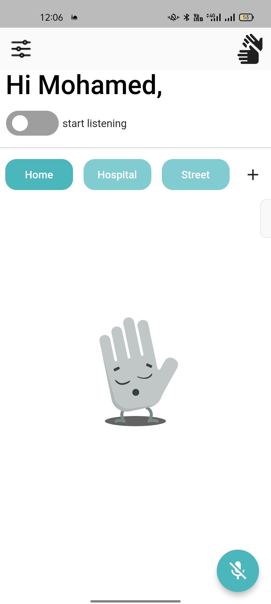
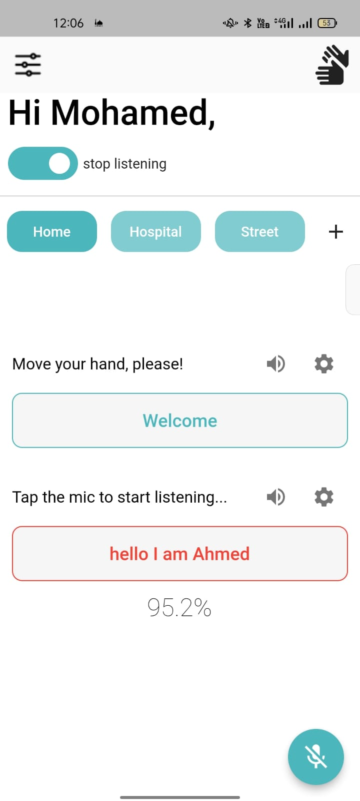
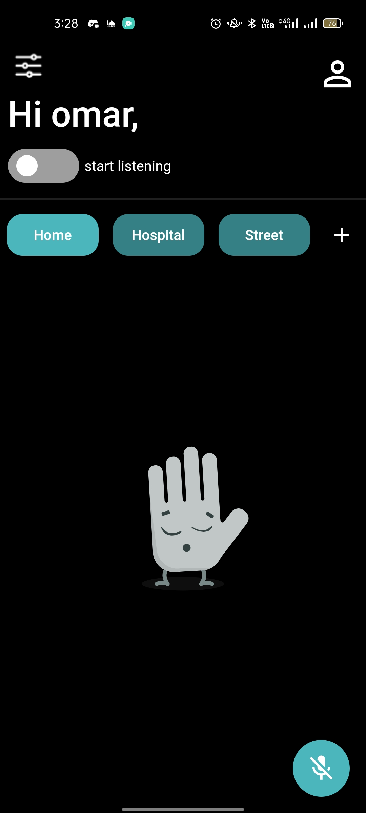
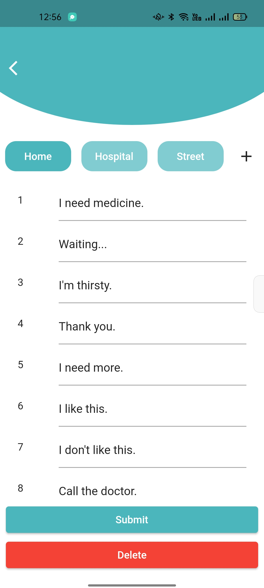

<div align="center">
  <h1> 🤟 Sign Talk </h1>
  <p><b>Bridging the communication gap between the Deaf community and the hearing world.</b></p>
  <p><i>🎓 A Graduation Project Prototype</i></p>
</div>

<br />

## 📋 Project Overview
**Sign Talk** is a mobile application developed as a **graduation project** to facilitate two-way communication for Deaf and Hard-of-Hearing individuals. The app acts as a translation bridge, converting sign language data (via sensor integration) into audible speech and transforming spoken words into text.

### ⚠️ Important Disclaimer
> **Note:** This is a **graduation project prototype** developed for academic purposes. It is **not** intended for commercial production or real-life critical use. The current version serves as a proof of concept to demonstrate how sensor data and mobile technology can interact to support accessibility.

### 🖼️ Screenshots
<div align="center">
  <table>
    <tr>
      <td></td>
      <td></td>
      <td></td>
      <td></td>
    </tr>
    <tr>
      <td align="center">Home Screen 1</td>
      <td align="center">Home Screen 2</td>
      <td align="center">Home Screen Dark 1</td>
      <td align="center">Edit Screen</td>
    </tr>
  </table>
</div>

## 🎬 App Demo
<div align="center">
  <p>Watch the <b>Sign Talk</b> prototype in action, demonstrating real-time gesture recognition and speech-to-text functionality.</p>

  <video src="https://github.com/user-attachments/assets/ba714136-6fd9-4f34-bfa2-09513823927f" width="100%" controls>
    Your browser does not support the video tag. 
    <a href="https://github.com/user-attachments/assets/ba714136-6fd9-4f34-bfa2-09513823927f">Click here to download the video.</a>
  </video>
  
  <p><i>Note: If the video does not play automatically, please click the play button.</i></p>
</div>

---

## 🎯 The Goal
The primary objective of this project is to explore how assistive technology can reduce the isolation faced by Deaf individuals. By integrating hardware sensors (Smart Glove) with a mobile interface, the project aims to:
1.  **Empower the User:** Provide a voice to those who use sign language through Text-to-Speech (TTS).
2.  **Facilitate Understanding:** Help Deaf users understand hearing people by converting speech into real-time on-screen text.
3.  **Academic Research:** Test the feasibility of using Bluetooth serial data to interpret hand gestures within a Flutter environment.

---

## 🚀 Key Features
* **Two-Way Translation:** * **Sign-to-Speech:** Interprets data from a connected Bluetooth glove and speaks the result.
    * **Speech-to-Sign/Text:** Captures audible speech and displays it for the Deaf user.
* **Bluetooth Connectivity:** Real-time pairing with external hardware using `flutter_bluetooth_serial`.
* **Firebase Integration:** Secure user authentication and profile management via Google Sign-In.
* **Dynamic UI:** Features a customized drawer, Lottie animations for engagement, and a dark/light mode toggle.
* **Accessibility Tools:** Built-in Speech-to-Text (STT) with confidence ratings and customizable Text-to-Speech (TTS) voices.

---

## 🛠️ Tech Stack
* **Framework:** Flutter (Dart)
* **Backend:** Firebase Auth & Firebase Core
* **State Management:** Provider
* **Navigation:** GoRouter
* **Core APIs:** * `flutter_tts` (Text to Speech)
    * `speech_to_text` (Voice Recognition)
    * `flutter_bluetooth_serial` (Hardware Communication)

---

## 💻 How to Setup
1.  **Clone the project:**
    ```bash
    git clone [https://github.com/ahmed-mohamed74/sign-talk-app.git](https://github.com/ahmed-mohamed74/sign-talk-app.git)
    ```
2.  **Install Dependencies:**
    ```bash
    flutter pub get
    ```
3.  **Firebase Configuration:**
    * Add your `google-services.json` to `android/app/`.
4.  **Hardware Connection:**
    * Ensure your Bluetooth sensor/glove is active and paired with your mobile device before launching the "Start Listening" mode.

---
<div align="center">
  <p><i>“Technology is at its best when it brings people together.”</i></p>
</div>
